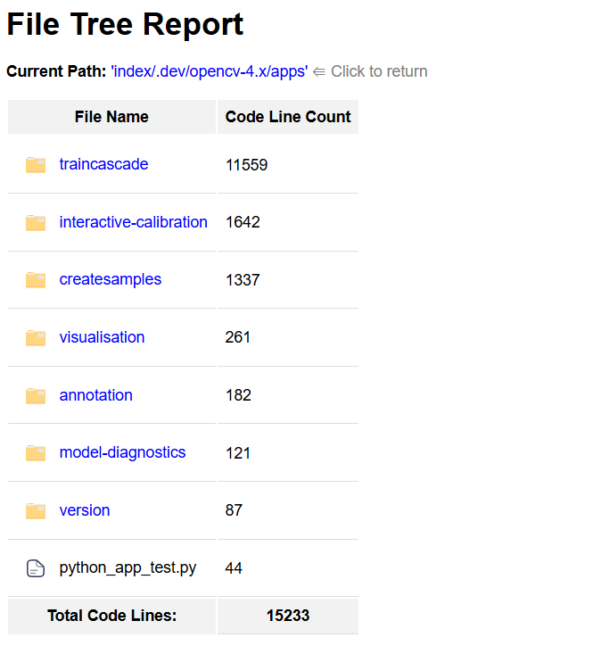

# Go-Cloc

## Tutorial

[](https://youtu.be/Yu2WXEgtMCc)

## Overview

This tool quickly calculates an accurate Lines of Code (LOC) count for a file or directory with a single executable. 

It is **significantly more performant** than the [cloc](https://github.com/AlDanial/cloc) tool. See [performance benchmark](#performance-benchmarks) for comparisons.

## Installation

To get started with **go-cloc**, you can either download the binary manually or use the provided install script.

### Option 1: Manual Download

1. Visit the [Releases page](https://github.com/sonar-solutions/go-cloc/releases).
2. Download the appropriate binary for your operating system and architecture.
3. Extract the ZIP file and run the binary using your terminal (Linux/macOS) or PowerShell (Windows).

```sh
# Linux/macOS
/home/user/Downloads/go-cloc

# Windows (PowerShell)
C:\Users\MyUser\Downloads\go-cloc.exe
```

To make `go-cloc` available globally, either:

* Move it to a directory in your `PATH`, or
* Run it by specifying the full path.

Once it's on your `PATH`, you can run it like this:

```sh
go-cloc -h
```

### Option 2: Install Script (Recommended for Linux/macOS)

You can install `go-cloc` using the official install script:

```sh
curl -fsSL https://github.com/sonar-solutions/go-cloc/releases/latest/download/install.sh | bash
```

This script detects your OS and CPU architecture, downloads the correct binary, and extracts it in your current directory. You can then move it to `/usr/local/bin` or another location in your `PATH`.

## Usage
Simply run the below command to calculate the Lines of Code (LOC) for the file or directory.
```sh
# Scan a single file
go-cloc test.js

# Scan all files in a directory and give statistics in both HTML and CSV formats
go-cloc folder --html html-reports-folder --csv results.csv
```

This will output the total Lines of Code (LOC) count for the entire code base. See example below.
```
2024/09/29 17:37:05 [INFO] Setting Log Level to INFO
2024/09/29 17:37:05 [INFO] Parsing CLI arguments
2024/09/29 17:37:05 [INFO] Scanning  src/main ...
2024/09/29 17:37:05 [INFO] Code   Blank lines   Comments   Total
2024/09/29 17:37:05 [INFO] 1450   100           100        1650
2024/09/29 17:37:05 [INFO] For detailed reporting, please use the --csv or --html options.
2024/09/29 17:37:05 [INFO] Results by file for  src/main :
2024/09/29 17:37:05 [INFO] Total LOC for  src/main  is  1450
1450
```


To most accurately undertand the LOC, it is recommended to use both the `--html` and `--csv` options together. The HTML report will make it easy to navigate through your file structure to understand how the folders and files contribute to the total LOC. You can also use the CSV reports to quickly exclude files that are not relevant to your project using a program like Excel or similar tools. For more information on how to use these options, see [HTML Reports](#html-reports) and [CSV Reports](#csv-reports).

### HTML Reports

The HTML reports are helpful for quickly reviewing the results of your code analysis in the same way you would the file system. Here is an example of what the HTML report might look like:

<!-- insert an image here -->
[]

These are not generated by default but see [options](#options) for more details on how to generate them.

### CSV Reports

The CSV reports provide a structured way to store the results of your code analysis, which can be useful for further processing with tools like Excel or similar tools. Here is an example of what the CSV report might look like:
```csv
filePath,languageName,blank,comment,code
/path/file1.js,JavaScript,10,100,1000
/path/file2.java,Java,10,100,1000
/path/file3.py,Python,10,100,1000
total,,30,300,3000
```

These are not generated by default but see [options](#options) for more details on how to generate them.


## Options
```sh
./go-cloc --help
```
-  `--csv`
        Path to dump results to a csv file, otherwise results are printed to standard out
-  `--html`
        Path to dump HTML reports into a specified directory, otherwise HTML reports are not generated. Note this directory must already exist.
-  `--ignore-file-path`
        Path to your ignore file. Defines directories and files to exclude when scanning. Please see the README.md for how to format your ignore configuration
-  `--log-level`
        Log level - DEBUG, INFO, WARN, ERROR (default "INFO")
-  `--override-languages`
        Path to languages configuration to override the default configuration.
-  `--print-languages`
        Prints out the supported languages, file suffixes, and comment configurations. Does not run the tool.

## Ignore Files

The ignore file is a simple text file used to exclude certain directories and files from processing. You can use a wildcard (`*`) to match patterns, similar to regular expressions. However, you can only use one `*` wildcard at a time. Make sure to place your ignore patterns in the ignore file, one per line, to apply them effectively.

- To ignore all files in a specific directory:

```sh
/path/to/directory/*
```

- To ignore all files ending in `.log` or `.js`:
```sh
*.log
*.js
```

* Combined examples
```sh
# Local scan with ignoring certain files or directories
$ ./go-cloc src/main --ignore-file-path ignore.txt
```

## Extensibility
If successful, the tool will print the total lines of code (LOC) count on its own line. See below for an example. If it fails, it will return a non-zero exit code for easy integration with scripts or other 3rd party tools.
```sh
# Below shows the final LOC outputted on its own line for ease of use
2024/10/20 01:54:22 [INFO] total,200,0,1450
2024/09/29 17:37:05 [INFO] Total LOC for  src/main  is  1450
# Example final line below
1450
```
## Performance Benchmarks

```sh
# Scanning 1 Billion Lines of Code

# go-cloc finished in < 5s
time ./go-cloc one-billion-loc-test
3.9s user 0.72s system 93% cpu 4.976 total

# cloc finished in ~2.5 minutes
time cloc one-billion-loc-test
128.48s user 4.22s system 96% cpu 2:17.72 total
```

## Language Support
Below is the default language configuration.

```json
{
  "Abap": {
    "LineComments": ["\""],
    "MultiLineComments": [["/*", "*/"]],
    "Extensions": [".abap", ".ab4", ".flow"],
    "FileNames": []
  },
  "ActionScript": {
    "LineComments": ["//"],
    "MultiLineComments": [["/*", "*/"]],
    "Extensions": [".as"],
    "FileNames": []
  },
  "Apex": {
    "LineComments": ["//"],
    "MultiLineComments": [["/*", "*/"]],
    "Extensions": [".cls", ".trigger"],
    "FileNames": []
  },
  "C": {
    "LineComments": ["//"],
    "MultiLineComments": [["/*", "*/"]],
    "Extensions": [".c"],
    "FileNames": []
  },
  "C Header": {
    "LineComments": ["//"],
    "MultiLineComments": [["/*", "*/"]],
    "Extensions": [".h"],
    "FileNames": []
  },
  "C#": {
    "LineComments": ["//"],
    "MultiLineComments": [["/*", "*/"]],
    "Extensions": [".cs"],
    "FileNames": []
  },
  "C++": {
    "LineComments": ["//"],
    "MultiLineComments": [["/*", "*/"]],
    "Extensions": [".cpp", ".cc", ".cxx", ".c++"],
    "FileNames": []
  },
  "C++ Header": {
    "LineComments": ["//"],
    "MultiLineComments": [["/*", "*/"]],
    "Extensions": [".hh", ".hpp", ".hxx", ".h++", ".ipp"],
    "FileNames": []
  },
  "COBOL": {
    "LineComments": ["*", "/"],
    "MultiLineComments": [],
    "Extensions": [".cbl", ".ccp", ".cob", ".cobol", ".cpy"],
    "FileNames": []
  },
  "CSS": {
    "LineComments": ["//"],
    "MultiLineComments": [["/*", "*/"]],
    "Extensions": [".css"],
    "FileNames": []
  },
  "Docker": {
    "LineComments": ["#"],
    "MultiLineComments": [],
    "Extensions": [".dockerfile"],
    "FileNames": ["Dockerfile"]
  },
  "Flex": {
    "LineComments": ["//"],
    "MultiLineComments": [["/*", "*/"]],
    "Extensions": [".as"],
    "FileNames": []
  },
  "Golang": {
    "LineComments": ["//"],
    "MultiLineComments": [["/*", "*/"]],
    "Extensions": [".go"],
    "FileNames": []
  },
  "HTML": {
    "LineComments": [],
    "MultiLineComments": [["<!--", "-->"]],
    "Extensions": [
      ".html",
      ".htm",
      ".cshtml",
      ".vbhtml",
      ".aspx",
      ".ascx",
      ".rhtml",
      ".erb",
      ".shtml",
      ".shtm",
      ".cmp"
    ],
    "FileNames": []
  },
  "JCL": {
    "LineComments": ["//"],
    "MultiLineComments": [["/*", "*/"]],
    "Extensions": [".jcl", ".JCL"],
    "FileNames": []
  },
  "Java": {
    "LineComments": ["//"],
    "MultiLineComments": [["/*", "*/"]],
    "Extensions": [".java", ".jav"],
    "FileNames": []
  },
  "JavaScript": {
    "LineComments": ["//"],
    "MultiLineComments": [["/*", "*/"]],
    "Extensions": [".js", ".jsx", ".jsp", ".jspx", ".jspf", ".mjs"],
    "FileNames": []
  },
  "Kotlin": {
    "LineComments": ["//"],
    "MultiLineComments": [["/*", "*/"]],
    "Extensions": [".kt", ".kts"],
    "FileNames": []
  },
  "Objective-C": {
    "LineComments": ["//"],
    "MultiLineComments": [["/*", "*/"]],
    "Extensions": [".m"],
    "FileNames": []
  },
  "Oracle PL/SQL": {
    "LineComments": ["--"],
    "MultiLineComments": [["/*", "*/"]],
    "Extensions": [".pkb"],
    "FileNames": []
  },
  "PHP": {
    "LineComments": ["//", "#"],
    "MultiLineComments": [["/*", "*/"]],
    "Extensions": [".php", ".php3", ".php4", ".php5", ".phtml", ".inc"],
    "FileNames": []
  },
  "PL/I": {
    "LineComments": ["--"],
    "MultiLineComments": [["/*", "*/"]],
    "Extensions": [".pl1"],
    "FileNames": []
  },
  "Python": {
    "LineComments": ["#"],
    "MultiLineComments": [["\"\"\"", "\"\"\""]],
    "Extensions": [".py", ".python", ".ipynb"],
    "FileNames": []
  },
  "RPG": {
    "LineComments": ["#"],
    "MultiLineComments": [],
    "Extensions": [".rpg"],
    "FileNames": []
  },
  "Ruby": {
    "LineComments": ["#"],
    "MultiLineComments": [["=begin", "=end"]],
    "Extensions": [".rb"],
    "FileNames": []
  },
  "SQL": {
    "LineComments": ["--"],
    "MultiLineComments": [["/*", "*/"]],
    "Extensions": [".sql"],
    "FileNames": []
  },
  "Scala": {
    "LineComments": ["//"],
    "MultiLineComments": [["/*", "*/"]],
    "Extensions": [".scala"],
    "FileNames": []
  },
  "Scss": {
    "LineComments": ["//"],
    "MultiLineComments": [["/*", "*/"]],
    "Extensions": [".scss"],
    "FileNames": []
  },
  "Swift": {
    "LineComments": ["//"],
    "MultiLineComments": [["/*", "*/"]],
    "Extensions": [".swift"],
    "FileNames": []
  },
  "T-SQL": {
    "LineComments": ["--"],
    "MultiLineComments": [],
    "Extensions": [".tsql"],
    "FileNames": []
  },
  "Terraform": {
    "LineComments": [],
    "MultiLineComments": [],
    "Extensions": [".tf"],
    "FileNames": []
  },
  "TypeScript": {
    "LineComments": ["//"],
    "MultiLineComments": [["/*", "*/"]],
    "Extensions": [".ts", ".tsx"],
    "FileNames": []
  },
  "Visual Basic .NET": {
    "LineComments": ["'"],
    "MultiLineComments": [],
    "Extensions": [".vb"],
    "FileNames": []
  },
  "Vue": {
    "LineComments": ["<!--"],
    "MultiLineComments": [["<!--", "-->"]],
    "Extensions": [".vue"],
    "FileNames": []
  },
  "XHTML": {
    "LineComments": ["<!--"],
    "MultiLineComments": [["<!--", "-->"]],
    "Extensions": [".xhtml"],
    "FileNames": []
  },
  "XML": {
    "LineComments": ["<!--"],
    "MultiLineComments": [["<!--", "-->"]],
    "Extensions": [".xml", ".XML", ".xsd", ".xsl"],
    "FileNames": []
  },
  "YAML": {
    "LineComments": ["#"],
    "MultiLineComments": [],
    "Extensions": [".yaml", ".yml"],
    "FileNames": []
  }
}

```
### Customization
To customize this configuration, copy the above JSON, customize it to your needs, and pass in the file path as `--override-languages-path`. See [options](#options) for more details.